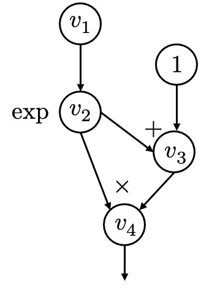
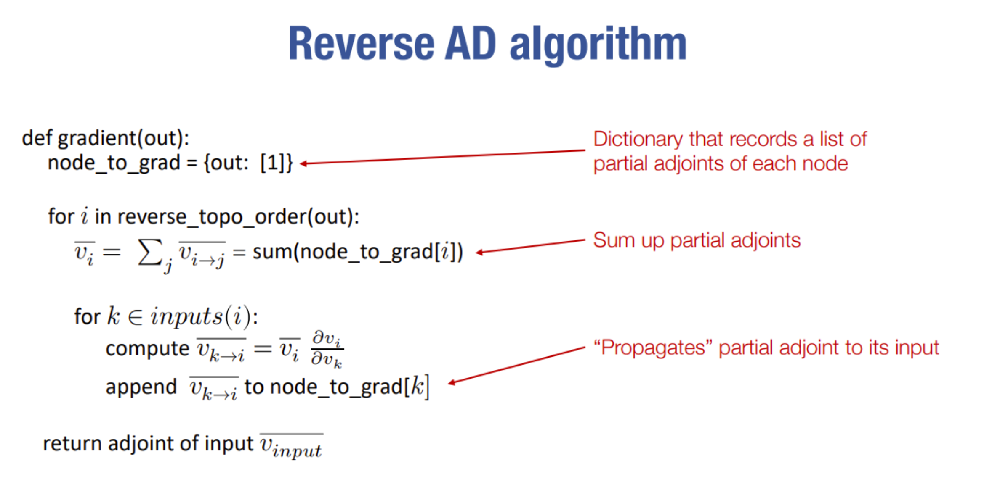

# 计算图

- **定义**
首先我们需要知道计算图（Computation graph）的概念


我们定义每一个节点是一个值：value。定义每条边是一个算子操作：op。通过遍历这张计算图我们就可以从输入：v1, 1,得到输出：v4。

$$v_1 = 0$$
$$v_2 = e^{v_1}$$
$$v_3 = v_2 + 1$$
$$v_4 = v_2 \times v_3$$
中间计算过程会包含各种不同的算子操作，有双目运算符也有单目运算符。

- **反向求导**
通过计算图的节点信息我们可以求出输出对于输入的偏导数,这涉及到对每个算子求导的操作，如：$\frac { \partial v_4}{\partial v_3}$
通过链式求导法则层层往上求导，得到 ：$\frac { \partial v_4}{\partial v_1}$
但这时会导致一个问题 
$$\frac { \partial v_4}{\partial v_1} = \frac { \partial v_4}{\partial v_2} \times \frac { \partial v_2}{\partial v_1}$$
而 $`\frac { \partial v_4}{\partial v_2} `$ 由两部分组成。（来自 $`v_4`$ 和 $`v_3`$ ） 我们如何知道哪些偏导有多个部分组成？他们的内在关系又如何处理？
首先定义 $`\overline{v_i}`$ 为输出对某个中间节点 $`i`$ 的偏导。再巧妙地定义 伴随值(adjoint)为 : 

$$\overline{v_{i\rightarrow j}} = \overline{v_j}\frac{\partial v_j}{\partial v_i}$$
（这里可以理解为从 $`i`$ 出发到 $`j`$ 的一条路径）。然后根据全微分公式得到

$$\overline{v_i} = \sum_{j \in {\rm next(i)}} \overline{v_j}\frac{\partial v_j}{\partial v_i }$$
我们就可以从最后的输出节点一层一层往上，得到对输入节点的偏导。这就是自动求导的原理。



#### 张量
经过我们对计算图基本的介绍，可以发现自动求导是整个框架的核心，因此我们在设计我们的基础数据结构Tensor时就需要考虑到把他设计成一个节点，图的一部分。  
在本框架中，我们沿用needle本身优秀的类型结构设计，具体介绍如下:       
+ **`Value`**：在计算图中计算的值，我们在这里定义了一个通用的父类
+ **`Op`**：计算图中的操作符。操作符需要在`compute()`方法中定义如何在`Value`对象上计算操作符的结果，以及通过`gradient()`方法定义其“反向”传递的结果。    
+ **`Tensor`**：这是`Value`的子类，对应于实际的张量输出，多维数组
+ **`TensorOp`**：这是`Op`的子类，用于对应张量的运算符。

设计一个父类的好处有很多，比如规范函数接口和类型等，这里不再赘述。
我们来看一个使用Mytorch里tensor的例子。
```python
     import mytorch as torch
     x = torch.Tensor([1, 2, 3],dtype="float32")
     y = torch.add_scalar(x, 1)
     print(y)
```
在这个片段中我们创造了两个tensor变量，他们是如何构建的呢？
首先我们来看一下tensor类有哪些部分组成：
```python
    # 算子操作
    op: Optional[Op]
    # 输入节点
    inputs: List["Value"]
    # 存储数据的核心部分(缓存)
    cached_data: NDArray
    # 梯度标志
    requires_grad: bool
```
$`x`$ 是由tensor的初始化方法产生，而 $`y`$ 是由计算产生的。我们重点研究 $`y`$ 的产生，涉及到动态图计算的特性，边计算边生成节点。这里涉及tensor类里的两个方法。
```python
     # 实现数据缓存
    def realize_cached_data(self):
        """运行计算来实现数据缓存"""
        # 避免重复计算
        if self.cached_data is not None:
            return self.cached_data #实际存储多维数组的地方
        self.cached_data = self.op.compute(
            *[x.realize_cached_data() for x in self.inputs]
        ) # 递归的计算产生缓存
        self.cached_data
        return self.cached_data
     
     @staticmethod
     # 从计算生成节点
    def make_from_op(op: Op, inputs: List["Value"]):
        tensor = Tensor.__new__(Tensor)
        tensor._init(op, inputs)
        # LAZY_MODE 是我们不想计算时使用的，先不生成缓存。
        if not LAZY_MODE:
            # requires_grad 是单个节点是否需要梯度，不需要的话可以
            # 从计算图中分离detach()出来，节省内存
            if not tensor.requires_grad:
                return tensor.detach()
            # 如果需要梯度则使用或计算缓存
            # 事实上不需要梯度也会计算缓存，不过是在detach()中计算。
            tensor.realize_cached_data()
        return tensor
```
以及TensorOp里的方法
```python
    # TenosorOp类
    class TensorOp(Op):
    """ Op的特例化子类 """
    # 使用这个类的时候的方法__call__如：TensorOp()
    def __call__(self, *args):
        # 返回tensor类型
        return Tensor.make_from_op(self, args)
    
    
    # 加常数的操作，特意化为一个子类
    class AddScalar(TensorOp):
        # 初始化一个常量为属性
        def __init__(self, scalar):
            self.scalar = scalar
        #前向计算
        def compute(self, a: NDArray):
            return a + self.scalar
        #反向传播
        def gradient(self, out_grad: Tensor, node: Tensor):
            return out_grad

    # 实际调用方法
    def add_scalar(a, scalar):
        return AddScalar(scalar)(a)
```
好我们现在来看看tensor $`y`$ 的生成流程，首先调用`add_scalar` 方法。生成一个`scalar`为`1`的`AddScalar`对象，这是一个TensorOp对象。然后我们调用了TensorOp的`__call__` 方法，传入的参数是`x`这个tensor。为了方便理解这个过程我们可以特例化这个类来理解
`AddScalar(1)(x) ==> Add1(x) ==> make_from_op(Add1(),x) `
实际上就是这样一行
`make_from_op(AddScalar(1),x)`
再回过头来看tensor的make_from_op方法，它需要传入一个操作类和输入节点。这里的输入节点只有 $`x`$，而 $`x`$ 的缓存在初始化时就生成了，所以这里不会递归的计算。一般来说，我们先初始化这个`Tensor`的`op`和`inputs`，再根据`op`和`inputs`计算这个节点的缓存。如果输入值也没有缓存，我们就继续往上递归的计算，最后完成这个节点的生成。  

现在相信通过一个简单的例子，大家明白了`tensor`是怎么构建和计算的，事实上，tensor类有大量的重载运算符（这也是导致它冗余的原因）来方便我们自然优雅的计算和生成节点。  

那么我们是如何打印出来tensor类型的呢？这涉及到`Tensor`的另一个方法。
```python
    def __repr__(self):
        return "mytorch.Tensor(" + str(self.realize_cached_data()) + ")"
```
`__repr__`魔法函数是用来打印数据结构自身信息的，意味着我们在使用
`print(y)`时等同于使用`print(y.__repr__)`。

- **自动求导的完整流程**
我们现在完全了解了一个tensor是怎么被构建的，那么要在计算图中实现自动梯度求导，我们还需要什么样的流程呢？
我们在前面给了一个流程图，现在我们来回顾一下完整的步骤：
1. 首先使用反向拓扑排序生成一个从输出到输入的序列
2. 通过每一个算子op的反向梯度，逐层生成 $`\overline{v_i}`$+
3. 到达输入节点，得到所求梯度，这时候要判断是否为叶子节点来终止计算

- **自动求导的完整代码**
注释已经写的十分清晰，直接看即可
```python
def compute_gradient_of_variables(output_tensor, out_grad):
    """获取输出节点相对于 node_list 中每个节点的梯度。
    将计算结果存储在每个变量的 grad 字段中。
    """
    # 每个节点对于输出梯度的来贡献来源（一个点对应不同的路径）
    node_to_output_grads_list: Dict[Tensor, List[Tensor]] = {}
    # 特别注意初始化梯度
    # 我们实际上是在求标量reduce_sum(output_node)的导数
    # 而不是向量output_node。 但使用sum是损失函数的常见情况。
    node_to_output_grads_list[output_tensor] = [out_grad]

    # 反向节点序列
    reverse_topo_order = list(reversed(find_topo_sort([output_tensor])))

    # 从反向拓扑序列取出节点
    for node_i in reverse_topo_order:
        # 取出从output到node_i的所有的部分梯度（路径来源）
        adjoint = node_to_output_grads_list[node_i]
        # 求部分梯度和，得到真正的梯度
        node_i.grad = sum(adjoint)
        # 判断是否为叶子节点（输入节点）
        if node_i.op is None:
            continue
        # 获取节点i的输入的节点梯度（可能有多个输入，所以用一个返回）
        partial_vk_to_i_list = node_i.op.gradient_as_tuple(node_i.grad, node_i)
        # 同时遍历节点i的输入节点和输入节点的梯度，这样就可以得到每一个输入节点的部分梯度（一个路径来源）
        for node_k, partial_vk_to_i in zip(node_i.inputs, partial_vk_to_i_list):
            node_to_output_grads_list.setdefault(node_k, list())
            node_to_output_grads_list[node_k].append(partial_vk_to_i)


def find_topo_sort(node_list: List[Value]) -> List[Value]:
    """
        做个拓扑排序，画出计算图
    """
    visited = set()
    topo_order = []
    topo_sort_dfs(node_list[-1], visited, topo_order)
    return topo_order


def topo_sort_dfs(node, visited, topo_order):
    """反向 DFS"""
    for pre_node in node.inputs:
        topo_sort_dfs(pre_node, visited, topo_order)
    if node not in visited:
        topo_order.append(node)
        visited.add(node)
```
